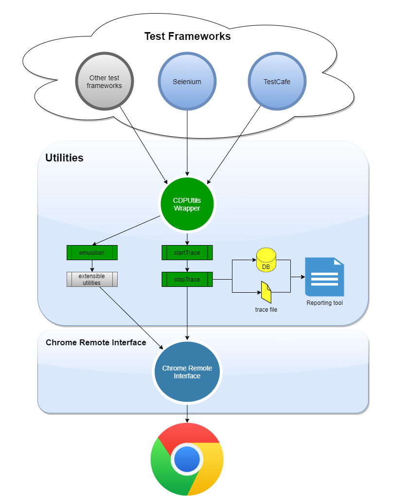
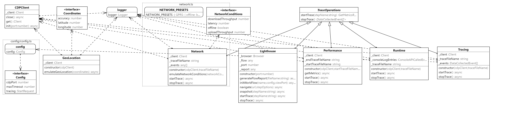

# CDP Utils

### A set of utilities/wrapper for Test Automation or Performance testing on top of Chrome DevTools Protocol [CDP](https://chromedevtools.github.io/devtools-protocol/)

<p align="center">
  
</p>

## Inspiration

It has been inspired in the power of CDP to interact with the browser like you would do using chrome dev tools but programmatically, **this library is independent of any test automation framework** since it talks directly with chrome using `--remote-debugging-port` commonly 9222 port. There are situations when we need to emulate or collect information from the browser during the execution of e2e tests. This lib intends to be an utility for testing purposes without the need to program each functionality.

More inpiration has been based on existing tools that are using this protocol like [puppeteer](https://github.com/puppeteer/puppeteer), see https://puppeteer.github.io/puppeteer/docs/puppeteer.tracing

## Important

It is not a replacement of any actual tool or library, instead it is just a wrapper with common utilities for Test Automation or Performance testing. For example Selenium 4 introduces a new powerful API which grants access to Chrome DevTools directly from your automated tests just accessing it by `driver.getDevTools();`, this is another way to use CDP programmatically in your scripts. It can be used also by importing directly `chrome-remote-interface` like this project is referencing in its package.json.

You are very welcome if you feel that can contribute with more utilities to take advantaje of this great API.

## Usage

### Config (Only required for Tracing domain)

Create a config folder and place your cdp.config.json file there. It will contain configurations needed for tracing such as including or excluding categories and more. See the following example of how it will look like:

For more information about how to use traceConfig, see [TraceConfig](https://chromedevtools.github.io/devtools-protocol/tot/Tracing/#type-TraceConfig)

```json
{
  "tracing": {
    "traceConfig": {
      "includedCategories": [
        "-*",
        "devtools.timeline",
        "v8.execute",
        "disabled-by-default-devtools.timeline",
        "disabled-by-default-devtools.timeline.frame",
        "toplevel",
        "blink.console",
        "blink.user_timing",
        "latencyInfo",
        "disabled-by-default-devtools.timeline",
        "disabled-by-default-devtools.timeline.frame",
        "disabled-by-default-devtools.timeline.stack",
        "disabled-by-default-devtools.screenshot",
        "disabled-by-default-v8.cpu_profiler"
      ],
      "excludedCategories": ["-*"]
    }
  },
  "cdpPort": 9222,
  "maxTimeout": 50000
}
```

### Tracing

The following example shows how to use the Tracing class with Selenium Webdriver.

```js

import { CDPClient, Tracing } from "cdp-utils";

it('Test tracing', async () => {
  const options = new chrome.Options();

  options.addArguments(`--remote-debugging-port=${port}`);

  const driver = await new Builder()
    .forBrowser('chrome')
    .setChromeOptions(options)
    .build();

  const googlePage = new GooglePage(driver);

  // Initializes the CDP client connection
  const cdpClient = new CDPClient();
  await cdpClient.init(port);

  // Instantiates the class and produces a file as result of the trace
  const tracing = new Tracing(cdpClient, 'tracing.json');

  // start tracing
  await tracing.startTrace();

  // here you perform your test steps

  // stop tracing
  const tracingResults = await tracing.stopTrace();

  // do whatever with trace

  // Close the CDP client connection
  await cdpClient.close();

  await driver.quit();
}

```

### Network

The following example shows how to use the Network class with Selenium Webdriver. Notice that it is possible to convert HAR object returned by `stopTrace` into a
more readable object. The obtained requests can be sent to a database to visualize them in a reporting tool like Grafana.

For more information about how to send metrics to a database, please check the documentation [Capturing requests](https://github.com/germanbisogno/cdp-utils/tree/main/src/performance#capturing-requests)

```js
import { Network, CDPClient } from 'cdp-utils';

it('Test Network', async () => {
  const options = new chrome.Options();

  options.addArguments(`--remote-debugging-port=${port}`);

  const driver = await new Builder()
    .forBrowser('chrome')
    .setChromeOptions(options)
    .build();

  const googlePage = new GooglePage(driver);
  const cdpClient = new CDPClient();
  await cdpClient.init(port);

  const network = new Network(cdpClient, 'network.har');

  await network.startTrace();

  // here you perform your test steps

  // Collect network data
  const networkResults: Har = await network.stopTrace();
  expect(networkResults.log.entries.length).greaterThan(0);

  // Convert HAR to an request object
  const requests = Utils.transformHar(networkResults);
  // Send metrics to a database
  await DatabaseManager.getDatabaseProvider().sendRequests(requests);

  // Close the CDP client connection
  await cdpClient.close();

  await driver.quit();
});
```

### Performance

An example using the Performance class with Selenium Webdriver.

```js

import { CDPClient, Performance } from 'cdp-utils';

it('Test performance', async () => {
  const options = new chrome.Options();

  options.addArguments(`--remote-debugging-port=${port}`);

  const driver = await new Builder()
    .forBrowser('chrome')
    .setChromeOptions(options)
    .build();

  const googlePage = new GooglePage(driver);

  // Initializes the CDP client connection
  const cdpClient = new CDPClient();
  await cdpClient.init(port);

  // Instantiates the class and produces two files as result of the trace
  const performance = new Performance(
    cdpClient,
    'startTrace.json',
    'endTrace.json'
  );

  // start tracing
  const perfStartResults = await performance.startTrace();

  await driver.get('https://www.google.com');

  await googlePage.search('test');

  const perfEndResults = await performance.stopTrace();

  // Perform assertions or do whatever with perfStartResults or perfEndResults

  // Close the CDP client connection
  await cdpClient.close();

  await driver.quit();
}

```

### Lighthouse

An example using the Lighthouse class with Selenium Webdriver. Notice that it combines lighthouse/puppeteer in order to initialize the workflow with the configuration required and navigate to the first page.

```js

import { Lighthouse } from 'cdp-utils';
import { desktopConfig } from 'lighthouse';

it('Test performance', async () => {
  const options = new chrome.Options();

  options.addArguments(`--remote-debugging-port=${port}`);

  const driver = await new Builder()
    .forBrowser('chrome')
    .setChromeOptions(options)
    .build();

  const googlePage = new GooglePage(driver);

  const lighthouse = new Lighthouse(port);

  await lighthouse.initWorkFlow('Google search', desktopConfig);

  await lighthouse.navigate('https://www.google.com');

  await lighthouse.startTrace('search operation');

  await googlePage.search('test');

  const res = await lighthouse.stopTrace();

  await driver.quit();

  await lighthouse.generateFlowReport('lighthouse.html');

  // make assertions using RunnerResult array
  res.forEach((step) => {
    expect(step.lhr.categories.performance.score).greaterThanOrEqual(0.8);
  });
}

```

#### User flow

Finally, Lighthouse will produce a report showing the user flow similar to the following:

<p align="center">
  
</p>

## Install

```sh

npm install

```

## Build

```sh

npm run build

```

## Run tests

```sh

npm run test

```

## Classes diagram

<p align="center">
  
</p>
