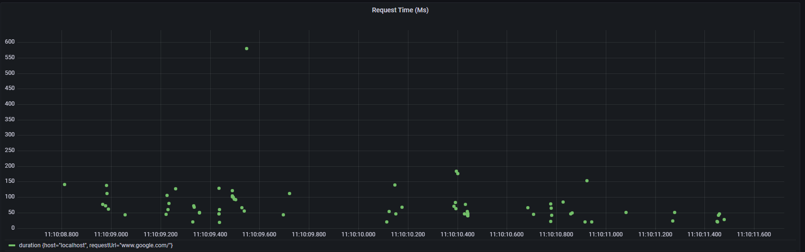

## Capturing requests

It is possible to capture requests during your test execution using `startTrace/stopTrace` methods from the `Network` domain, but also you can convert the results
from HAR format to a more friendly object to extract some information from the request, this conversion is possible by using the following utility:

```js
  ...

  const networkResults: Har = await network.stopTrace();
  const requests = Utils.transformHar(networkResults);

```

Now that you have the list of requests, they can be sent to a desired storage, currently it is supported for InfluxDB which can be consumable from a Grafana dashboard to show your requests in a fashion way.

The following example shows how to send your requests to a database:

```js
  import { DatabaseManager } from '../performance/databaseManager';
  ...

  const networkResults: Har = await network.stopTrace();
  const requests = Utils.transformHar(networkResults);
  await DatabaseManager.getDatabaseProvider().sendRequests(requests);

```

## Grafana

This time we will be showing the metrics for each request, then you will be able to analyze the response time in Grafana tool as the image below shows:

<p align="center">
  
</p>
